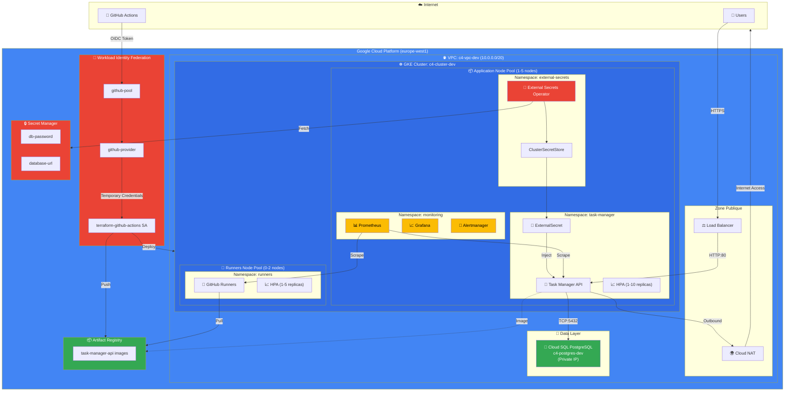
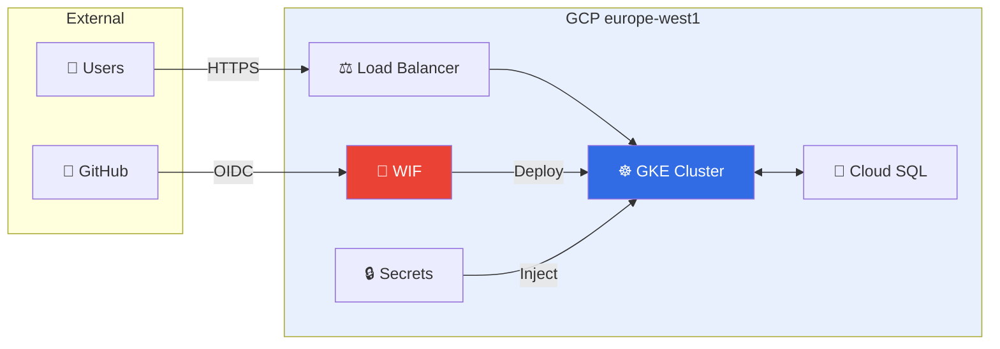
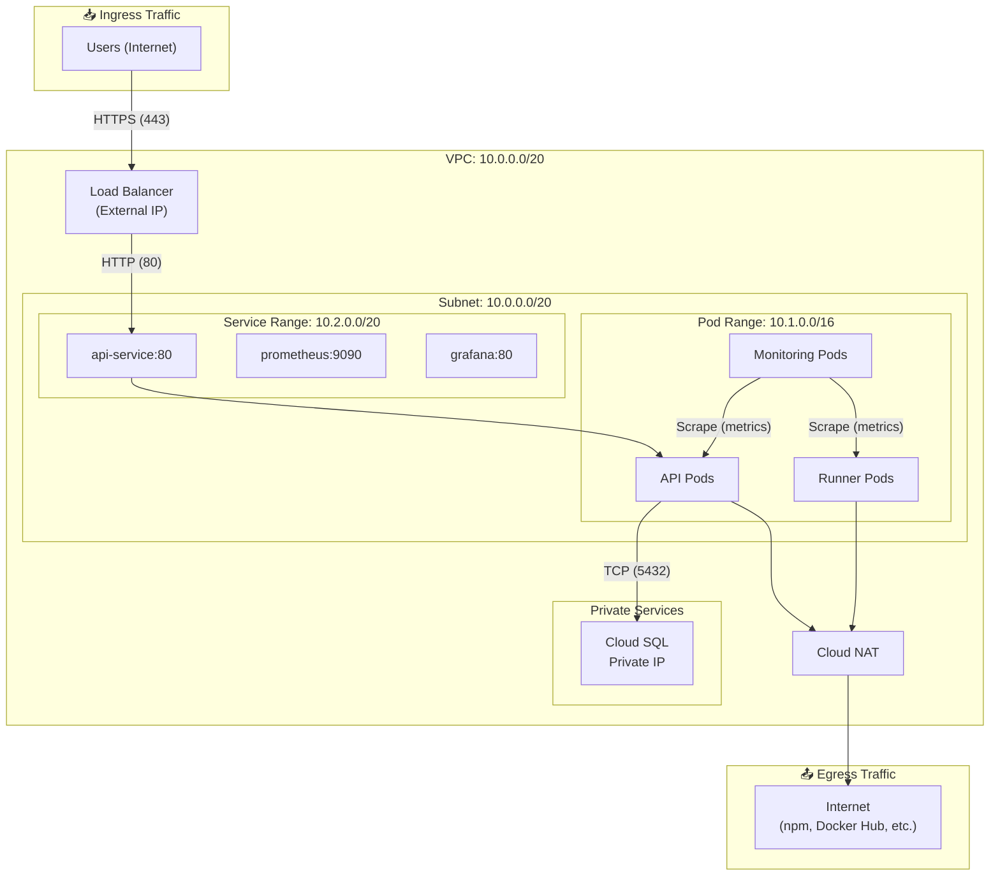
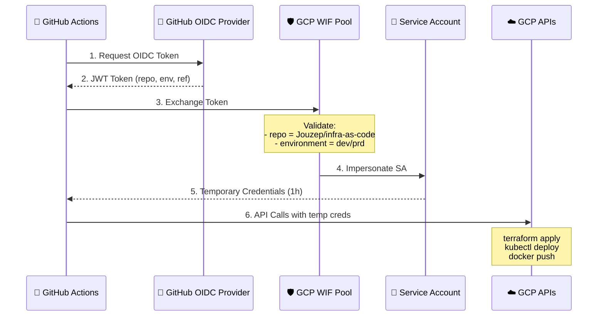
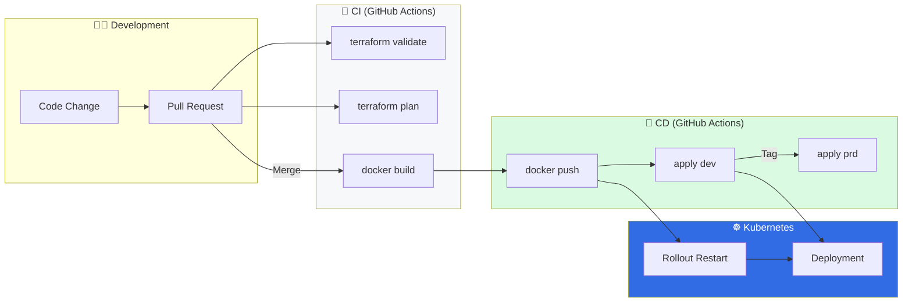

# C4 Architecture Diagram

## Diagramme Principal (Mermaid)



---

## Diagramme Simplifié (Pour Présentation)



---

## Diagramme des Flux Réseau



---

## Diagramme Workload Identity Federation



---

## Diagramme CI/CD Pipeline



---

## Diagramme ASCII (Pour Terminal/Documentation)

```
┌─────────────────────────────────────────────────────────────────────────────────┐
│                              INTERNET                                            │
│    ┌──────────┐                                      ┌──────────────────┐       │
│    │  Users   │                                      │  GitHub Actions  │       │
│    └────┬─────┘                                      └────────┬─────────┘       │
│         │ HTTPS                                               │ OIDC            │
└─────────┼─────────────────────────────────────────────────────┼─────────────────┘
          │                                                     │
          ▼                                                     ▼
┌─────────────────────────────────────────────────────────────────────────────────┐
│                         GCP (europe-west1)                                       │
│  ┌─────────────────────────────────────────────────────────────────────────┐    │
│  │                    Workload Identity Federation                          │    │
│  │   github-pool ──► github-provider ──► terraform-github-actions SA       │    │
│  └─────────────────────────────────────────────────────────────────────────┘    │
│                                                                                  │
│  ┌─────────────────────────────────────────────────────────────────────────┐    │
│  │                      VPC: c4-vpc-dev (10.0.0.0/20)                       │    │
│  │                                                                          │    │
│  │   ┌──────────────┐     ┌────────────────────────────────────────────┐   │    │
│  │   │ Load Balancer│────►│         GKE: c4-cluster-dev                │   │    │
│  │   └──────────────┘     │  ┌──────────────────────────────────────┐  │   │    │
│  │                        │  │     Application Pool (1-5 nodes)     │  │   │    │
│  │                        │  │  ┌─────────────┐  ┌───────────────┐  │  │   │    │
│  │                        │  │  │ task-manager│  │  monitoring   │  │  │   │    │
│  │                        │  │  │  API (HPA)  │  │ Prom+Grafana  │  │  │   │    │
│  │                        │  │  └──────┬──────┘  └───────────────┘  │  │   │    │
│  │                        │  └─────────┼────────────────────────────┘  │   │    │
│  │                        │            │                               │   │    │
│  │                        │  ┌─────────┼────────────────────────────┐  │   │    │
│  │                        │  │     Runners Pool (0-2 nodes)         │  │   │    │
│  │                        │  │  ┌─────────────────────────────────┐ │  │   │    │
│  │                        │  │  │   GitHub Self-Hosted Runners    │ │  │   │    │
│  │                        │  │  └─────────────────────────────────┘ │  │   │    │
│  │                        │  └──────────────────────────────────────┘  │   │    │
│  │                        └────────────────────────────────────────────┘   │    │
│  │                                     │                                    │    │
│  │   ┌──────────────┐                  │ TCP:5432                          │    │
│  │   │  Cloud NAT   │◄─── Pods ────────┤                                   │    │
│  │   └──────┬───────┘                  ▼                                   │    │
│  │          │                 ┌─────────────────┐                          │    │
│  │          │                 │   Cloud SQL     │                          │    │
│  │          │                 │   PostgreSQL    │                          │    │
│  │          │                 │  (Private IP)   │                          │    │
│  │          │                 └─────────────────┘                          │    │
│  └──────────┼──────────────────────────────────────────────────────────────┘    │
│             │                                                                    │
│             ▼                                                                    │
│     ┌───────────────┐    ┌────────────────┐    ┌─────────────────┐             │
│     │Artifact Regis.│    │ Secret Manager │    │   IAM Roles     │             │
│     │  (Images)     │    │  (Passwords)   │    │ (Permissions)   │             │
│     └───────────────┘    └────────────────┘    └─────────────────┘             │
└─────────────────────────────────────────────────────────────────────────────────┘
```

---

## Légende des Composants

| Composant | Description | Configuration |
|-----------|-------------|---------------|
| **VPC** | Réseau isolé | 10.0.0.0/20, europe-west1 |
| **GKE Cluster** | Kubernetes managé | 2 node pools, Workload Identity |
| **Application Pool** | Nodes pour apps | e2-standard-2, 1-5 nodes, autoscaling |
| **Runners Pool** | Nodes pour CI/CD | e2-medium, 0-2 nodes, taint dedicated |
| **Cloud SQL** | PostgreSQL managé | db-f1-micro (dev), private IP, backups |
| **Cloud NAT** | Accès sortant | Pour pods sans IP publique |
| **Load Balancer** | Entrée externe | Service type LoadBalancer |
| **WIF** | Auth sans secrets | GitHub OIDC → GCP credentials |
| **ESO** | Sync secrets | GCP Secret Manager → K8s Secrets |
| **Prometheus** | Métriques | 15 jours retention, alertes |
| **Grafana** | Dashboards | Visualisation métriques |

---

## Comment Visualiser

### Option 1: Mermaid Live Editor
1. Aller sur https://mermaid.live/
2. Copier le code Mermaid
3. Exporter en PNG/SVG

### Option 2: VS Code
1. Installer extension "Markdown Preview Mermaid Support"
2. Ouvrir ce fichier en preview (Cmd+Shift+V)

### Option 3: GitHub
1. Push ce fichier sur GitHub
2. Les diagrammes Mermaid sont rendus automatiquement

### Option 4: Draw.io
1. Aller sur https://app.diagrams.net/
2. Utiliser le diagramme ASCII comme référence
3. Créer manuellement avec les icônes GCP
