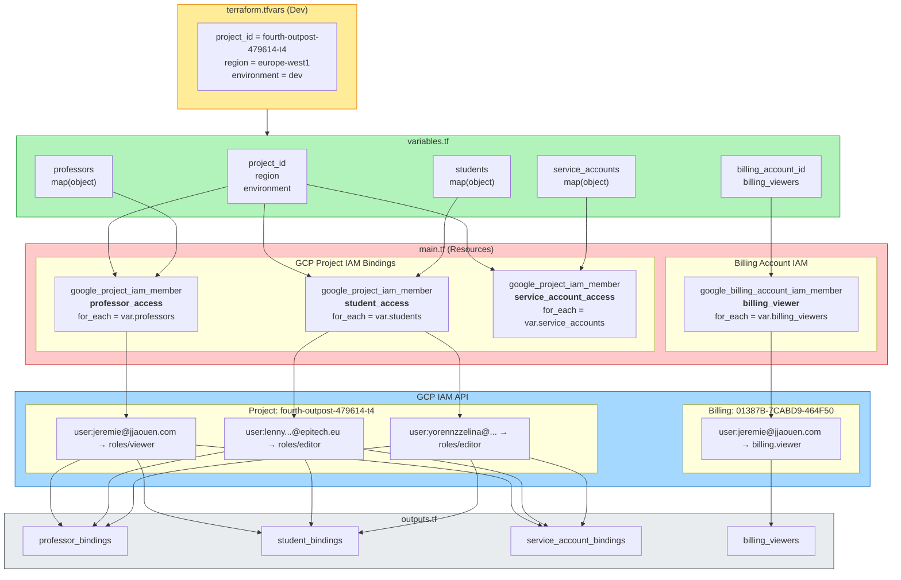
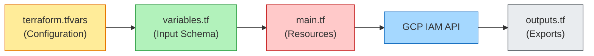
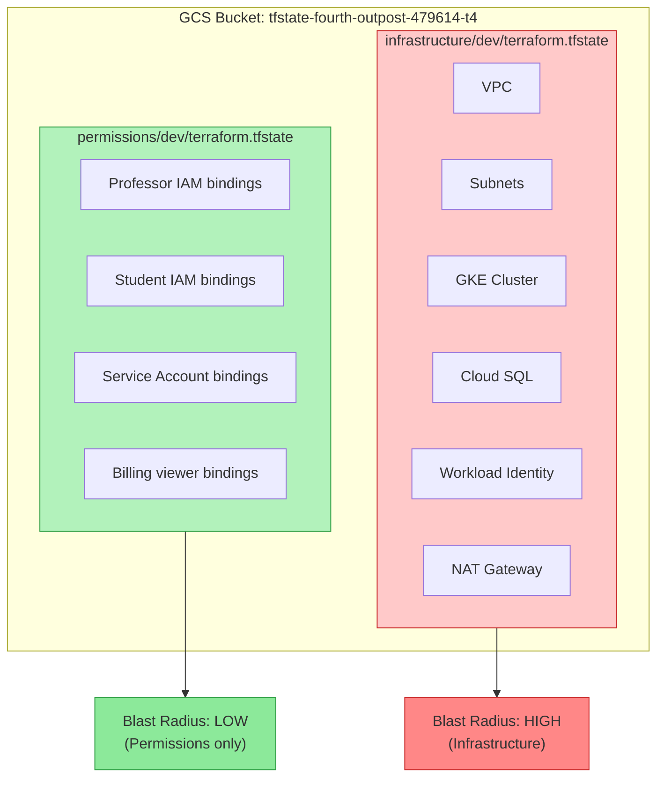
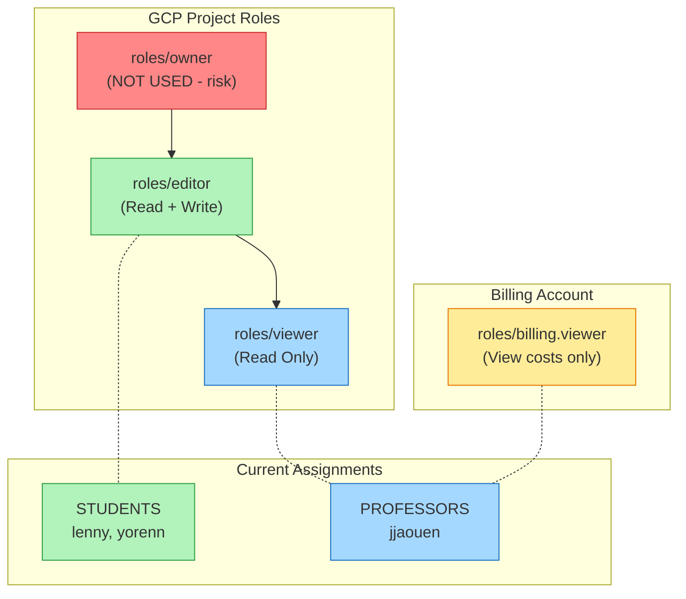
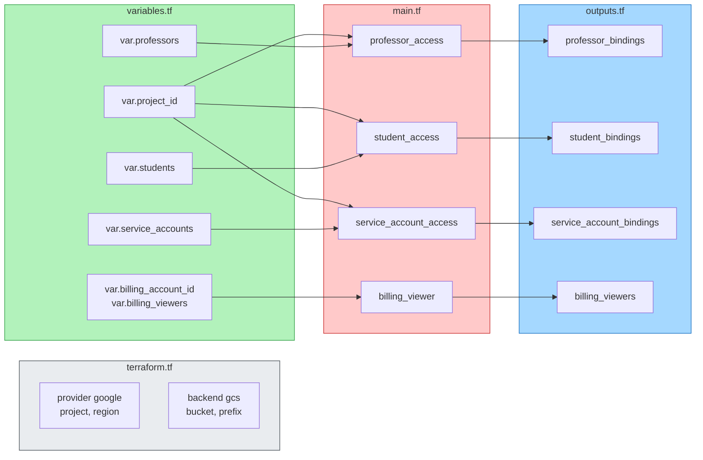
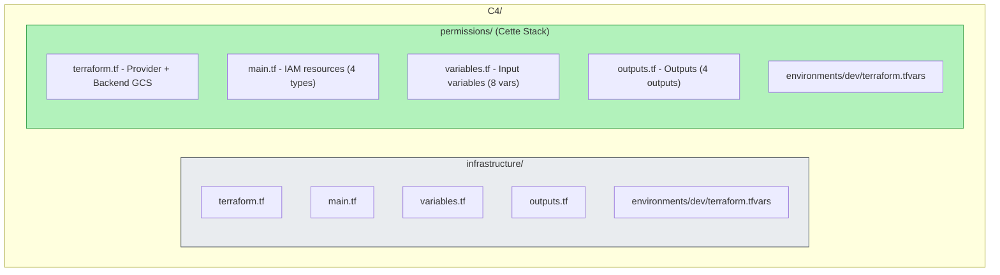
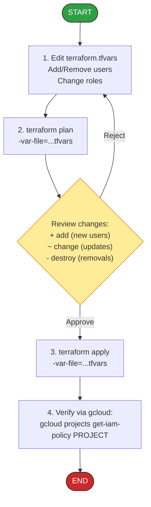
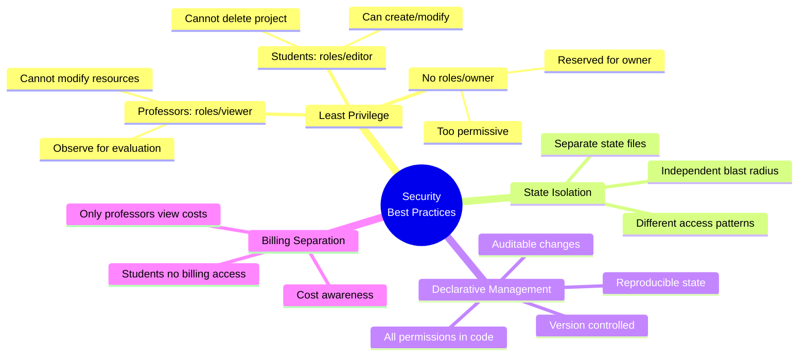

# C4 Permissions Stack - Architecture Diagram

## Overview

La **Permissions Stack** est une stack Terraform isolée qui gère exclusivement les permissions IAM GCP pour l'équipe du projet C4.

---

## Architecture Diagram



---

## Data Flow Diagram



---

## State Isolation Diagram



### Benefits of Separation

| # | Benefit |
|---|---------|
| 1 | Independent lifecycles |
| 2 | Different change frequencies |
| 3 | Limited blast radius |
| 4 | Separate access control |
| 5 | Faster terraform operations |

---

## Role Hierarchy Diagram



---

## Terraform Resource Map



---

## Current Configuration Summary

| Category | Key | Email | Role | Access Level |
|----------|-----|-------|------|--------------|
| **Professors** | jjaouen | jeremie@jjaouen.com | roles/viewer | Read-only project |
| **Students** | lenny | lenny.vongphouthone@epitech.eu | roles/editor | Read + Write |
| **Students** | yorenn | yorennzzelina@hotmail.fr | roles/editor | Read + Write |
| **Service Accounts** | (none) | - | - | - |
| **Billing Viewers** | - | jeremie@jjaouen.com | billing.viewer | View costs only |

**Project**: `fourth-outpost-479614-t4`
**Region**: `europe-west1`
**Environment**: `dev`

---

## Access Matrix

| User | Project View | Project Edit | Billing View | Create Resources | Delete Resources |
|------|:------------:|:------------:|:------------:|:----------------:|:----------------:|
| jjaouen (prof) | ✅ | ❌ | ✅ | ❌ | ❌ |
| lenny (student) | ✅ | ✅ | ❌ | ✅ | ✅ |
| yorenn (student) | ✅ | ✅ | ❌ | ✅ | ✅ |

---

## File Structure



---

## Workflow Diagram



---

## Security Considerations



---

## Quick Reference Commands

```bash
# Initialize
cd C4/permissions
terraform init

# Plan changes
terraform plan -var-file=environments/dev/terraform.tfvars

# Apply changes
terraform apply -var-file=environments/dev/terraform.tfvars

# View current state
terraform state list

# View outputs
terraform output

# Verify in GCP
gcloud projects get-iam-policy fourth-outpost-479614-t4 \
  --flatten="bindings[].members" \
  --format="table(bindings.role, bindings.members)"
```

---

## Related Documentation

- [C4 Permissions README](../permissions/README.md) - Usage guide
- [C4 Infrastructure README](../infrastructure/README.md) - Infrastructure stack
- [C4 Project Structure](../../C4_PROJECT_STRUCTURE.md) - Overall structure
- [C4 Implementation Plan](../../C4_IMPLEMENTATION_PLAN.md) - Full implementation guide
